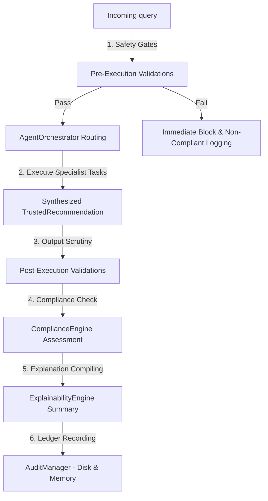

# AI Governance & Policy Platform

The AI Governance & Policy Platform enforces enterprise-level safety, auditable logs, policy compliance, and detail explainability across all AI-driven decision pathways.

---

## 1. Architectural Layout

The governance check layer intercepts every query request before routing execution steps to specialist agents and verifies responses before returning them to the user:



---

## 2. Policy Evaluation Flow

Policies are scoped hierarchically to apply general and context-specific rules:

- **System Policies**: Globally active limits matching forbidden query strings, spam behaviors, and instruct injections.
- **Tenant Policies**: Domain restrictions scoped to specific tenant identifiers (`tenant_id`).
- **Organization Policies**: Boundary rules matching organization divisions (`organization_id`).
- **Model Policies**: Defines which LLM engines are approved for specific processing tasks.

---

## 3. Rule Evaluation Pipeline

Rules are categorized by lifecycle validation stages:

```
[Query Input]
  │
  ├── Pre-execution Rules (Min prompt length checks)
  │
  ├── Safety Rules (SQL injection checks, destructive patterns)
  │
  ├── [Agent Orchestrator Runs]
  │
  ├── Post-execution Rules (Completeness verification)
  │
  └── Escalation Rules (Low confidence / high risk human handoff triggers)
```

---

## 4. Compliance Model

The `ComplianceEngine` dynamically checks if execution metadata flags have breached any policies or rules. It maintains a compliance record for each transaction, tracking:
- **`status`**: Compliant vs Non-Compliant status.
- **`policy_violations`**: Logged details of matched policies.
- **`rule_violations`**: Logged details of failed rules.
- **`model_compliant`**: Asserts that only approved model pipelines were checked out.

---

## 5. Partitioned Audit Pipeline

Audit logs are recorded securely to prevent cross-tenant information bleed:
- **In-Memory Ledger**: Uses tenant-isolated list descriptors (`TenantIsolatedListDescriptor`) ensuring that memory structures are completely partitioned per active tenant thread context.
- **On-Disk Ledger**: Writes log lines to `data/governance_audit.jsonl` which Python's dynamic path redirection patches to `data/tenants/{tenant_id}/governance_audit.jsonl`.
