# AI Orchestrator Engine Architecture

This document details the design, sequencing, and operational patterns of the **AI Orchestrator Engine** integrated during Phase 3 (Sprint 10).

---

## 1. Sequence & Orchestration Flow

The AI Orchestrator replaces sequential LangGraph iterations with a concurrent, rule-aware dispatcher:

```mermaid
sequenceDiagram
    autonumber
    actor Client as Omnichannel Client (Web/IVR/SMS)
    participant Orch as AgentOrchestrator
    participant Router as IntentRouter
    participant Plan as DynamicPlanner
    participant Agent as Specialized Agent Registry
    participant Chief as ChiefReasoningAgent
    participant Val as ResponseValidator
    participant Build as ResponseBuilder

    Client->>Orch: execute_query(ExecutionRequest)
    Note over Orch: Load Profile, Crops, Location & Conversation History
    Orch->>Router: detect_intent(query)
    Router-->>Orch: returns intent + extracted entities
    Orch->>Plan: select_agents(intent)
    Plan-->>Orch: returns list of required agent keys
    
    rect rgb(10, 45, 90)
        Note over Orch: Concurrently trigger independent agents (asyncio.gather)
        Orch->>Agent: execute Weather/Market/Scheme etc.
        Agent-->>Orch: returns serialized AgentResults & Evidences
    end

    Orch->>Chief: reason(parsed_evidences)
    Chief-->>Orch: returns consensus ReasoningResult
    Orch->>Build: build_trusted_recommendation(...)
    Build-->>Orch: returns unified recommendation payload
    Orch->>Val: validate(recommendation)
    Val-->>Orch: appends safety warnings / gaps indicators
    Orch-->>Client: returns StandardResponse
```

---

## 2. Dynamic Agent Selection

Intents detected by the `IntentRouter` are mapped to target agent arrays:

| Detected Intent | Required Agents list | Fallback / Context |
| :--- | :--- | :--- |
| `Government Scheme` | `GovernmentScheme`, `Knowledge`, `LLM` | Queries Yojana database |
| `Weather` | `Weather`, `Knowledge`, `LLM` | Gathers regional forecasts |
| `Market Price` | `Market`, `Knowledge`, `LLM` | Looks up Mandi price records |
| `Crop Disease` | `Knowledge`, `LLM` | Diagnostics query matching |
| `Document Help` | `GovernmentScheme`, `Memory`, `LLM` | Required papers assistance |
| `Greeting` | `Memory`, `LLM` | Friendly welcome dialect response |
| `Voice Command` | `Memory`, `LLM` | Audio translation triggers |
| `General Question` | `Memory`, `Knowledge`, `LLM` | Standard fallback RAG answers |

---

## 3. Parallel Execution Performance

Executing independent agents concurrently via `asyncio.gather` improves execution latency by up to 60%, maintaining a strict latency threshold (<1.5s per turn).
