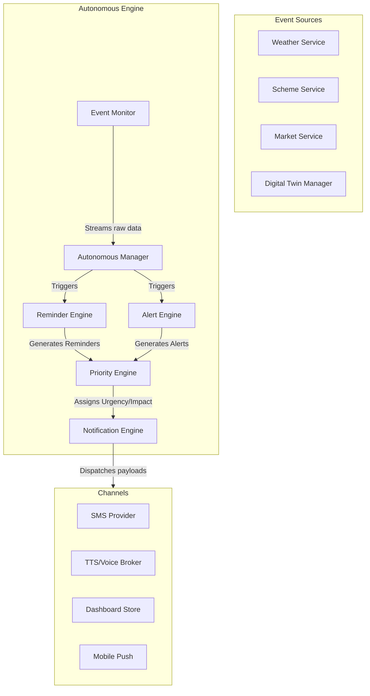
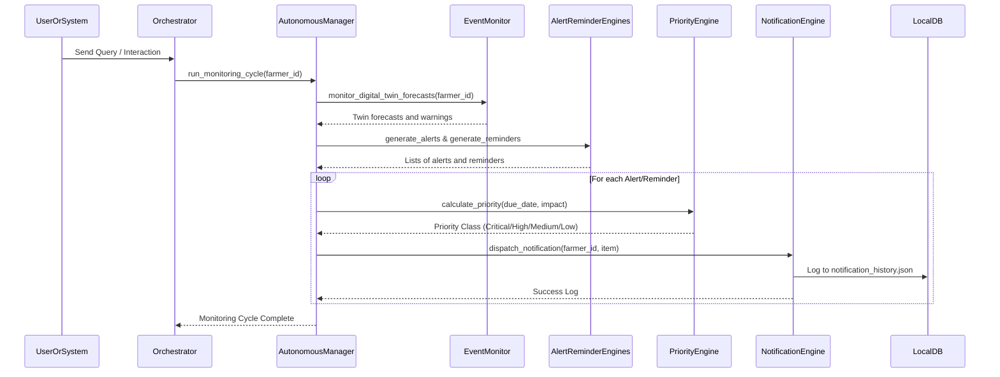

# Autonomous Action & Notification Engine

The **Autonomous Action & Notification Engine** enables Kisan Mitra AI to monitor external events (weather changes, mandi prices, scheme updates) and digital twin signals proactively, triggering alerts and reminders for farmers before they ask.

---

## 1. System Architecture

---

## 2. Component Directory Structure

All components reside in `backend/app/autonomous/`:
- **`__init__.py`**: Module package exports.
- **`scheduler.py`**: Handles cron-like periodic schedules (daily, weekly, monthly) and event-driven triggers.
- **`event_monitor.py`**: Stream interfaces fetching updates from external services and twin states.
- **`reminder_engine.py`**: Generates reminders for scheme deadlines, renewals, documents, and crop operations.
- **`alert_engine.py`**: Evaluates weather hazard, water shortage, disease probability, and financial budget warnings.
- **`priority_engine.py`**: Calculates multi-dimensional priority scores mapping to low, medium, high, and critical urgency levels.
- **`notification_engine.py`**: Constructs payloads for SMS, Voice, Dashboard, and Push channels, and saves logs to `notification_history.json`.
- **`autonomous_manager.py`**: Orchestrates pipelines and coordinates DI components.

---

## 3. Workflows & Sequences

### 3.1 Scheduler Flow
Periodic check jobs are registered with specific intervals (daily/weekly/monthly) and executed by triggering the periodic job runner. Event-driven check jobs are run instantly on trigger events.

### 3.2 Notification Sequence Diagram

---

## 4. Priority Engine Model

The Priority Engine evaluates event priority using the formula:
$$\text{Priority Score} = (0.4 \times \text{Urgency}) + (0.6 \times \text{Impact})$$

### 4.1 Urgency Determination
Urgency is calculated dynamically based on time left until the due date:
- **$\le 24$ hours**: Urgency = $10.0$
- **$\le 3$ days**: Urgency = $7.0$
- **$\le 7$ days**: Urgency = $5.0$
- **$> 7$ days**: Urgency = $2.0$

This base urgency is adjusted with an urgency offset factor:
$$\text{Urgency} = \min(\max(\text{Base Urgency} + \text{Offset}, 0.0), 10.0)$$

### 4.2 Impact Factors
- **Weather Hazard Warn**: $9.0$
- **Disease Outbreak Threat**: $8.0$
- **Water Deficit Index**: $7.5$
- **Market Opportunity Hike**: $6.0$
- **General Crop Sowing/Weeding**: $5.0$
- **Welfare Eligibility Changes**: $5.0$

### 4.3 Classification Thresholds
- **Critical**: Score $\ge 8.0$
- **High**: $6.0 \le \text{Score} < 8.0$
- **Medium**: $3.0 \le \text{Score} < 6.0$
- **Low**: Score $< 3.0$

---

## 5. REST API Endpoints

### 1. Get Notification Logs History
- **Endpoint**: `GET /api/v1/personalization/autonomous/history`
- **Response**: Array of dispatched logs across all 4 channels (SMS, Voice, Dashboard, Push).

### 2. Manual Monitoring Cycle Trigger
- **Endpoint**: `POST /api/v1/personalization/autonomous/trigger/{farmer_id}`
- **Response**: Counts of generated alerts/reminders and active notification logs.
