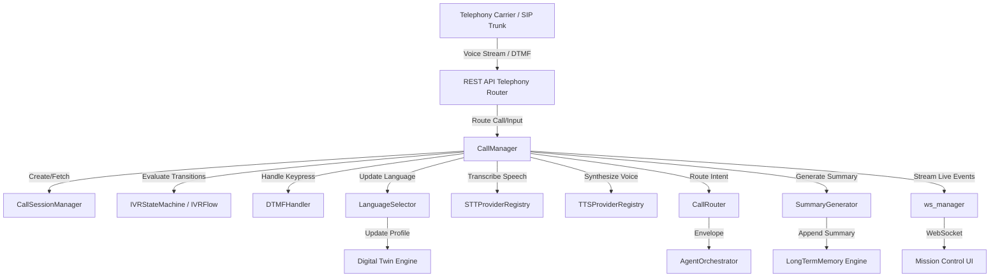
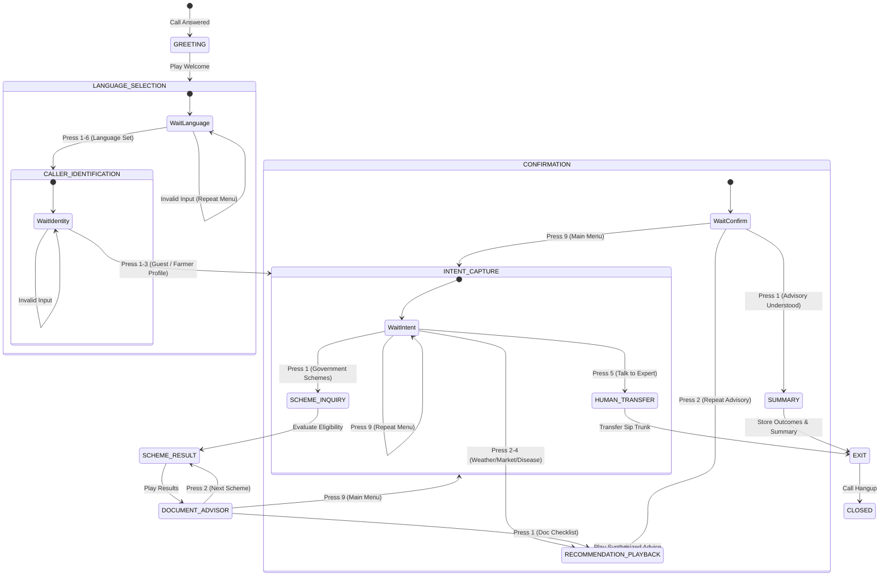

# IVR & Voice Platform (MVP)

The Kisan Mitra AI IVR & Voice Platform MVP transforms the conversational assistant into an accessible, voice-based assistant operable from any basic mobile phone (feature phone). This backend-driven platform supports multi-lingual operations, real-time telemetry streaming to Mission Control, DTMF inputs, conversational transcription, and persistence to the Memory Engine.

---

## 1. Architecture Overview

The voice platform integrates directly with the telephony endpoints (SIP/Twilio/Plivo/BSNL/Exotel), maps calls to in-memory sessions, transcribes speech inputs, routes them to the AI Agent Orchestrator, synthesizes responses, and streams updates via WebSockets:

---

## 2. Call Lifecycle & State Transitions

Active voice sessions progress through a deterministic state machine managed by `IVRFlow` and `DTMFHandler`:

---

## 3. Telephony DTMF Key Mappings

The primary menu supports quick routing using the telephone keypad:

| Key | Option Action / Intent | Output Transition State |
| :--- | :--- | :--- |
| **`1`** | Government Schemes Eligibility | `SCHEME_INQUIRY` -> `SCHEME_RESULT` |
| **`2`** | Weather Advisory | `RECOMMENDATION_PLAYBACK` (Weather query) |
| **`3`** | Crop Market Prices | `RECOMMENDATION_PLAYBACK` (Market query) |
| **`4`** | Crop Disease Advice | `RECOMMENDATION_PLAYBACK` (Disease query) |
| **`5`** | Transfer to Human Agent / Callback Request | `HUMAN_TRANSFER` |
| **`9`** | Repeat Menu Options / Return to Main Menu | `INTENT_CAPTURE` (Repeat) |

---

## 4. Multi-Language Support

Kisan Mitra AI supports **6 major agricultural languages** inside the IVR Flow:
- **Hindi (`hi`)** - DEFAULT
- **English (`en`)**
- **Kannada (`kn`)**
- **Telugu (`te`)**
- **Tamil (`ta`)**
- **Punjabi (`pa`)**

### Language Selection Flow
1. Telephony session is initialized with default language `hi`.
2. Caller is presented the language selection prompts in all available tongues.
3. Caller presses a DTMF key matching their preference (e.g., `3` for Kannada).
4. `LanguageSelector` parses the key, sets `session.language` to `"kn"`, looks up the user's phone number, fetches their **Digital Twin** profile using `TwinManager`, and registers `"kn"` as the preferred language on their record (updating the personalization database).
5. All future voice menus and synthesized advisories on this call and subsequent interactions are automatically generated in the chosen language.

---

## 5. Live Events & Observability

During a call, the `CallManager` broadcasts real-time updates to Mission Control through the `ws_manager` WebSocket interface:

1. **`CALL_STARTED`**: Dispatched on answering, containing caller number and session ID.
2. **`CALLER_IDENTIFIED`**: Dispatched after language menu, containing farmer name and profile details.
3. **`DIGITAL_TWIN_LOADED`**: Broadcasts the loaded predictive model of the farmer.
4. **`SCHEME_SEARCH_STARTED`**: Fired when matching government schemes.
5. **`SCHEME_MATCHED`**: Fired iteratively as schemes are evaluated.
6. **`TRANSCRIPT_UPDATED`**: Fired whenever caller speak inputs or agent replies are processed.
7. **`CALL_COMPLETED`**: Dispatched on exit, transmitting total duration and the generated call summary.
