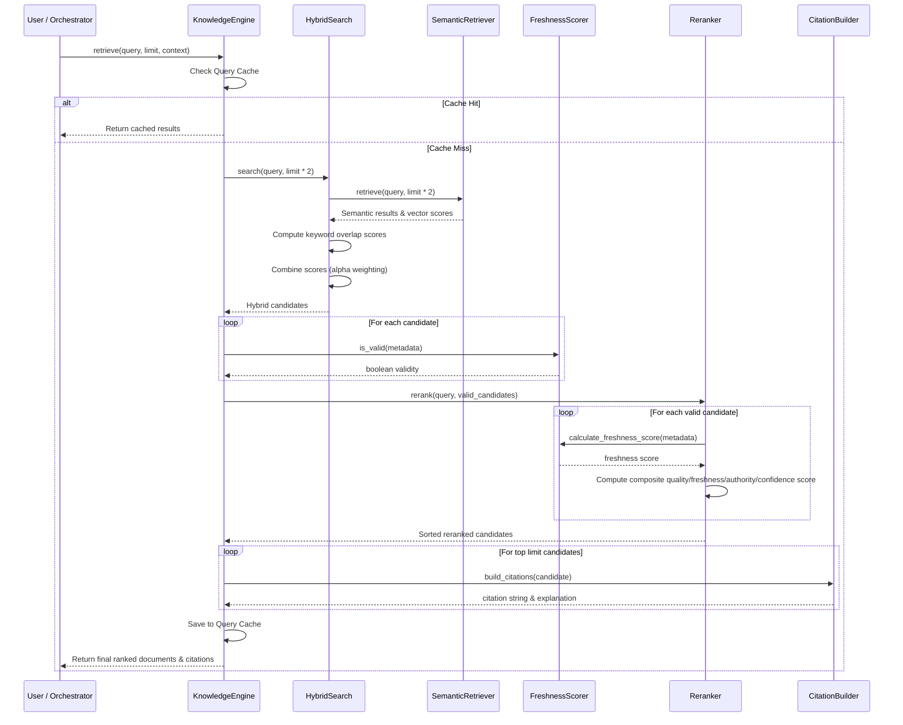

# Knowledge Intelligence Engine (KIE)

The **Knowledge Intelligence Engine (KIE)** is a production-grade semantic retrieval and knowledge management layer built for the Kisan Mitra AI Platform. It provides hybrid search, multi-criteria document re-ranking, versioned freshness scoring, citation compilation, and dual-layer caching.

---

## Architecture

The engine is located at `backend/app/knowledge_engine/` and consists of the following decoupled modules:

```
knowledge_engine/
│
├── __init__.py            # Module exports
├── knowledge_engine.py    # Central coordinator & caching manager
├── chunk_manager.py       # Document chunking & embedding cache
├── retriever.py           # Semantic vector search & document store
├── hybrid_search.py       # keyword + semantic fusion
├── freshness.py           # TTL, validity, deprecation, & version scores
├── reranker.py            # Multi-attribute scoring pipeline
└── citation_builder.py    # Structured citation & explainability builder
```

---

## Retrieval Flow

The retrieval flow follows a unified pipeline coordinates by the `KnowledgeEngine`. Below is the sequence diagram illustrating how requests are resolved:



---

## Ranking Pipeline

The **Reranker** evaluates and ranks candidates using five distinct dimensions. The composite score is computed as follows:

$$\text{Composite Score} = w_{\text{semantic}} \cdot S_{\text{semantic}} + w_{\text{quality}} \cdot S_{\text{quality}} + w_{\text{freshness}} \cdot S_{\text{freshness}} + w_{\text{confidence}} \cdot S_{\text{confidence}} + w_{\text{authority}} \cdot S_{\text{authority}}$$

### Weights & Criteria:
| Dimension | Default Weight | Description |
| :--- | :--- | :--- |
| **Semantic Similarity** | `0.40` | Fused score of keyword overlap and semantic vector cosine distance. |
| **Document Quality** | `0.15` | Metadata rating of formatting/detail depth (`0.0` - `1.0`). |
| **Freshness** | `0.15` | Validity check + version boost + exponential/linear age decay. |
| **Confidence** | `0.15` | Publisher trust rating (`0.0` - `1.0`). |
| **Authority** | `0.15` | Official source validation (e.g. Ministry / Central Gov get max score). |

---

## Caching Strategy

The KIE implements two specialized in-memory caches to guarantee low latency under high load:

1. **Query Cache**:
   - Caches complete retrieval results keyed by query string, limit, and category filter.
   - Entries have a default TTL of 300 seconds.
   - Supports invalidation by query string prefix or clearing the entire cache.
2. **Embedding Cache**:
   - Caches unit-normalized float arrays representing text embeddings.
   - Prevents redundant hash calculations or API network roundtrips for chunk evaluation.
   - Managed directly by `ChunkManager` and exposes invalidation handlers.

---

## Citations & Explainability

To support **AI Explainability**, every retrieved result is packaged with a formatted citation block:
* `document_id`: Unique identifier of the source file.
* `title`: Document title.
* `section`: Document section matching the content.
* `confidence`: The composite re-ranked score.
* `source_type`: Category of document (e.g. `government_scheme`, `crop_guide`).
* `citation`: Standardized user-facing reference string.
* `explanation`: Narrative explaining why the document was chosen, its publication authority, and its validity window.
