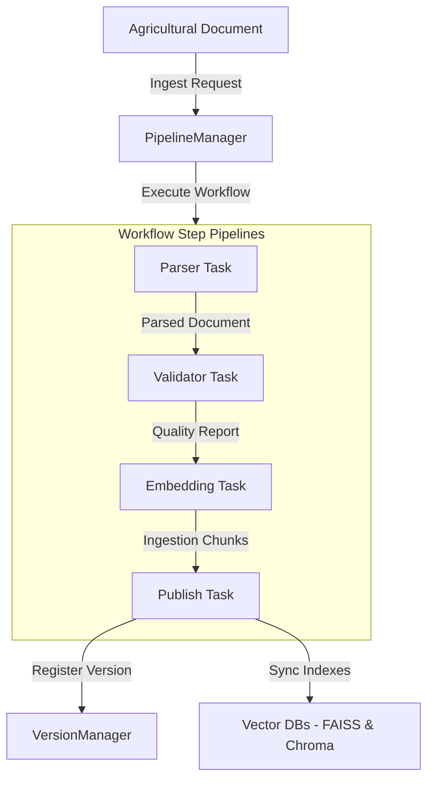
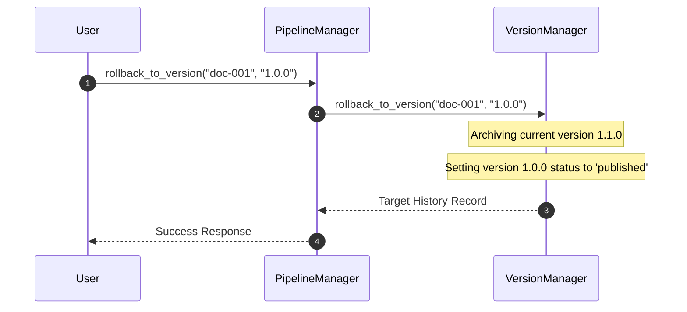

# Intelligent Knowledge Ingestion & Self-Updating Platform

The Intelligent Knowledge Ingestion & Self-Updating Platform manages the lifecycle of agricultural knowledge documents, including parsing, validating, chunking, embedding, versioning, and publishing to vector database indexes.

---

## 1. Architecture Overview

Ingestion operations are scheduled and processed through the central Workflow engine:

---

## 2. Document Parser

The `DocumentParser` processes documents across six primary formats:
- **Markdown (`.md`)**: Splits content by headings (`#`, `##`), extracting tabular data and metadata properties.
- **JSON (`.json`)**: Extracts title, sections list, language, and custom properties.
- **CSV (`.csv`)**: Reads structured datasets, exposing tables for direct querying.
- **HTML (`.html`)**: Extracts the document title and sanitizes elements to leave clean body strings.
- **PDF & DOCX (`.pdf`, `.docx`)**: Simulated binary text stream parsers extracting structured sections and metadata annotations (e.g. `[title]`, `[version]`, `[language]`).

---

## 3. Validation Engine

The `ValidationEngine` evaluates documents against quality requirements:
- **Duplicates**: Calculates SHA256 checksums of document headings/contents, rejecting duplicate text blocks.
- **Outdated Versions**: Compares dot-notated semantic versions (e.g. `1.1.0` vs `1.0.0`) to prevent downgrading.
- **Broken Metadata**: Ensures `doc_id`, `title`, and `version` fields are present and non-empty.
- **Incomplete Ingestions**: Flags empty sections or missing content bodies.

---

## 4. Version Manager & Rollbacks

The `VersionManager` handles document lifecycle version logs and transitions:
- **History Record Logs**: Keeps full record representations of previous versions.
- **Lifecycle Status States**: Toggles statuses (`draft`, `published`, `archived`) during new imports.
- **Version Diffs**: Compares line-by-line changes between document revisions using `difflib`.
- **Active Rollbacks**: Reverts the active published representation of a document to a historic version:

---

## 5. Embedding & Publishing

- **Text Chunking**: The `EmbeddingPipeline` splits section content bodies into smaller parts (word limit 300) to keep LLM context scopes compact.
- **Sync Commits**: The `Publisher` commits chunk blocks to active vector stores (`FAISSVectorStore` and `ChromaVectorStore`) and links entries in the platform catalog.

---

## 6. Observability Metrics

The pipeline registers telemetry events through the central `ObservabilityManager`:
- `ingestion_time` (ms): Measures total duration of the ingestion pipeline workflow.
- `embedding_latency` (ms): Measures duration of vector indexing.
- `pipeline_throughput` (count): Tracks document ingestion rates.
- `version_count` (count): Tracks cumulative registered history records.
- `ingestion_failure` (count): Logs parsing/validation exceptions.
