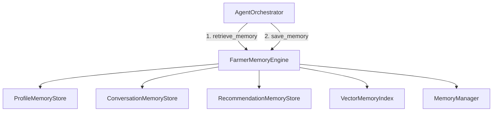
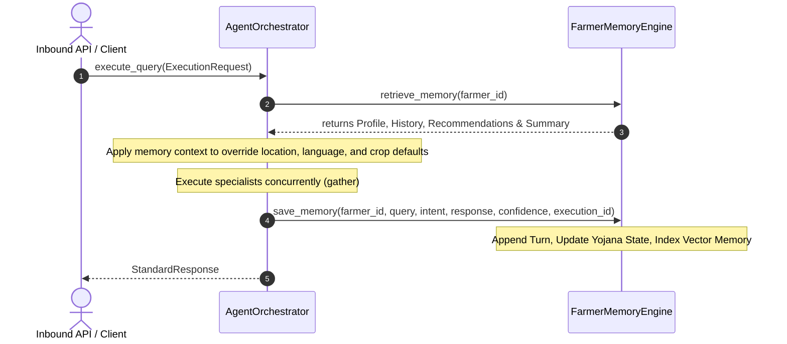

# Persistent Farmer Memory Engine Architecture

This document outlines the architecture, data schemas, and execution sequences of the **Persistent Farmer Memory Engine** implemented during Phase 3 (Sprint 11).

---

## 1. System Components & Orchestration

The Memory Engine coordinates profile parameters, dialogue exchanges, yojana outcomes, and semantic indexes:



* **`ProfileMemoryStore`**: Persists profile options, languages, locations, and twin snapshots.
* **`ConversationMemoryStore`**: Logs inbound dialogue turns, intents, response contents, and performance parameters.
* **`RecommendationMemoryStore`**: Evaluates historical yojana lists, rejected items, and document submission pipelines.
* **`VectorMemoryIndex`**: Implements simple Jaccard-similar term indexing to match queries against past advisories.
* **`MemoryManager`**: Evaluates relative scores using a combined Jaccard relevance, age decay curve, and confidence rating. Also compresses large conversation histories into consolidated summaries.

---

## 2. Ingress & Egress Execution Flows

Every query executed by `AgentOrchestrator` triggers the following lifecycle loops:



---

## 3. Storage Schema Definitions

Records are saved to disk under the `data/memory/` directory:

### A. Profiles (`profiles.json`)
```json
{
  "farmer_id": "farmer_ramesh",
  "preferred_language": "hi",
  "state": "Punjab",
  "district": "Ludhiana",
  "village": "Khanna",
  "land": 2.5,
  "crop_history": ["Wheat", "Rice"],
  "farm_size": 2.5,
  "digital_twin_snapshot": {}
}
```

### B. Dialogue Histories (`conversations.json`)
```json
[
  {
    "question": "Is it going to rain in Ludhiana?",
    "intent": "Weather",
    "response": "Light rain expected tomorrow afternoon.",
    "confidence": 0.95,
    "timestamp": 1783359600.0,
    "execution_id": "EXEC-12345"
  }
]
```

### C. Yojana Records (`recommendations.json`)
```json
{
  "recommended_schemes": ["pm-kisan"],
  "applied_schemes": [],
  "rejected_schemes": [],
  "completed_schemes": [],
  "documents_requested": ["Aadhaar", "Land Records"],
  "documents_submitted": []
}
```
