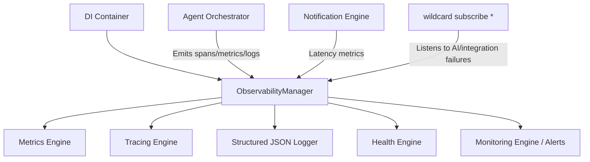
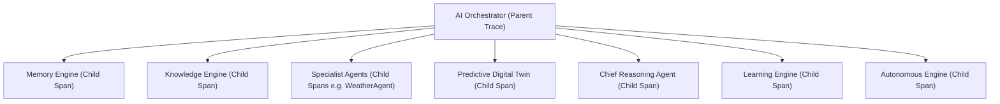

# Enterprise Observability & Operations Platform

Kisan Mitra AI is powered by a high-availability backend with a comprehensive observability architecture that tracks system performance, monitors API and agent health, alerts on anomalous states, and traces nested agent workflows across distributed frameworks.

---

## 1. Architecture Overview

The observability framework is structured under `backend/app/observability/` as a set of cohesive engine blocks managed by a central manager. It decouples telemetry collection from execution pathways while automatically tracking operation contexts.



---

## 2. Distributed Tracing Flow

Every query execution transaction is traced end-to-end. To link execution actions together, the tracing engine uses `contextvars` to pass down a unique:
- **`trace_id`**: Identifies a single complete user interaction session trace.
- **`execution_id`**: Tracks the individual query transaction request from start to finish.
- **`span_id`**: Identifies the specific sub-block or agent task execution unit.

Spans form a hierarchical directed graph using a parent-child relationship model:



---

## 3. Metrics Engine

The Metrics Engine gathers operational metrics, computing min, max, average, latest value, and sample counts in-memory:

| Metric Name | Description | Source Invocations |
| :--- | :--- | :--- |
| `api_latency` | Total latency from query submission to HTTP response. | `AgentOrchestrator.execute_query` |
| `agent_latency` | specialist agent task execution time. | specialist agent executor loop |
| `llm_latency` | LLM invocation response latency (Gemini, Claude, GPT). | `AIModelPlatform` completed events |
| `memory_retrieval` | Retrieval time for profile and history lookup. | Memory Engine database queries |
| `knowledge_retrieval` | Document search and re-ranking time. | Knowledge Engine search queries |
| `prediction_latency` | Digital twin model prediction pipelines runtime. | Twin prediction & risk engines |
| `notification_latency` | Notification formatting and delivery latency. | `NotificationEngine` dispatches |

---

## 4. Health Model

The Health Engine runs automated probes on all backend components:

- **Database**: Ping checking using a PostgreSQL `SELECT 1;` execution query.
- **Redis**: Connection verification via Redis client `ping()`.
- **Vector DB**: Connection checks using a `Chroma` client heartbeat probe.
- **Gemini**: Audits configuration of adapters in registry and presence of the GEMINI_API_KEY.
- **Scheduler**: Ensures the system calendar scheduling service is registered and active.
- **Notification Engine**: Checks for active notification dispatch adapters (SMS, push, email).
- **Memory Engine**: Ensures the Agricultural Reasoning Memory and profile services are active.
- **Knowledge Engine**: Checks core knowledge providers and ontologies are loaded.

---

## 5. Structured JSON Logging

All recorded metrics and alerts produce JSON logs structured like:
```json
{
  "timestamp": "2026-07-07T15:10:00Z",
  "message": "Execution recorded for WeatherAgent",
  "trace_id": "tr-a590b1c2",
  "execution_id": "ex-7cf2a912",
  "agent": "WeatherAgent",
  "latency_ms": 142.3,
  "error": null,
  "confidence": null
}
```

---

## 6. Alerting Rules

The platform automatically detects and logs anomalies under five criteria:

1. **High Latency**: Invocations exceeding `5000ms`.
2. **Repeated Failures**: Any agent or system component failing `3` times consecutively.
3. **Agent Crashes**: Any specialist throwing an unhandled python exception.
4. **External API Failures**: Detected by subscribing to wildcard `*` EventBus events (e.g., `IntegrationFailed`).
5. **Low Confidence Spikes**: Chief agent's overall consensus confidence dropping below `0.5` consecutively `3` times.

---

## 7. Performance Dashboard APIs

The platform registers internal API routes under `/api/v1/observability` for dashboard integrations:

- **`GET /api/v1/observability/metrics`**: Exposes aggregated system and execution latencies.
- **`GET /api/v1/observability/health`**: Runs live checkups on all subsystem connections.
- **`GET /api/v1/observability/traces`**: Returns collected span graphs.
- **`GET /api/v1/observability/system_status`**: Exposes CPU, Memory, and Platform diagnostics.
