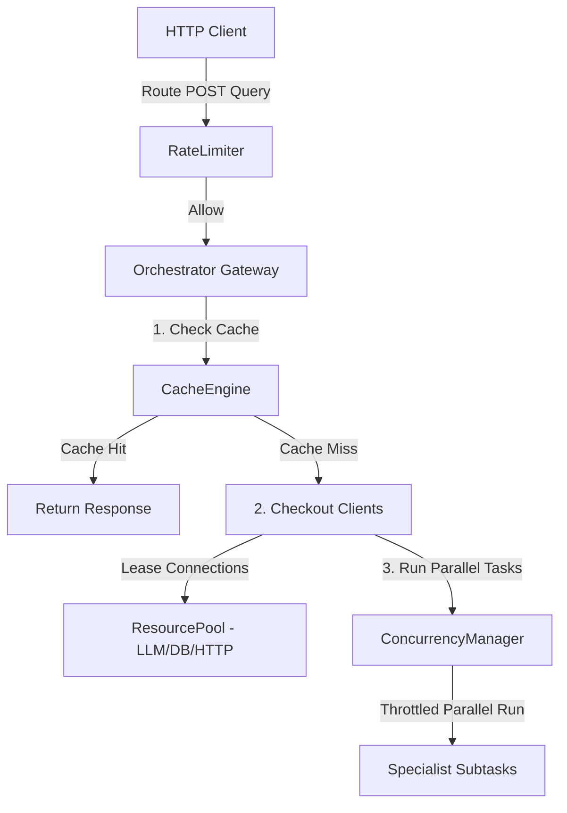

# Enterprise Scalability & Performance Platform

The Enterprise Scalability & Performance Platform optimizes the Kisan Mitra AI platform for production-scale deployments with in-memory caching layers, resource checkout pooling, concurrency managers, token-bucket rate limiters, and repeated stress testing suites.

---

## 1. Architecture Overview

Optimization layers intercept and throttle payloads at the API router, coordinate tasks concurrency, lease client connections, and bypass full plans via caching:

---

## 2. Caching Strategy

The `CacheEngine` manages in-memory key-value maps with configurable TTL windows:
- **Memory Cache**: Caches compiled standard query recommendations at the Orchestrator level, bypassing the entire multi-agent loop on duplicate inputs.
- **Knowledge Cache**: Caches vector document segments to avoid repeated similarity retrievals.
- **Embedding Cache**: Caches calculated query vectors.
- **Prediction Cache**: Caches digital twin states and risk assessments.
- **Eviction TTL**: Defaults to 300 seconds (5 minutes) and clears expired objects automatically.

---

## 3. Resource Pooling Strategy

The `ResourcePool` operates as an async context manager (`acquire()`), pre-spawning and leasing reusable connections to prevent resource exhaustion under high load:
- **LLM Clients**: Limits concurrent OpenAI/Gemini mock client leases.
- **Vector DB Clients**: Limits connections to FAISS and Chroma indexers.
- **Database Connections**: Coordinates connection reuse for transactional databases.
- **HTTP Clients**: Reuses httpx connection pipelines.

---

## 4. Concurrency Model

The `ConcurrencyManager` coordinates parallel executions under strict limits:
- **Parallel Agent Dispatch**: Runs intents-routed specialist agents concurrently via `ConcurrencyManager.execute_parallel` under a Semaphore, replacing unchecked `asyncio.gather`.
- **Workflow Steps**: Runs task blocks inside `ParallelStep` under concurrency limits.
- **Throttled Limits**: Restricts peak memory spikes and socket exhaustion under parallel loads.

---

## 5. Rate Limiting Throttling

The `RateLimiter` implements the **Token Bucket** algorithm supporting burst allowance:
- **User Limits**: Throttles requests per Authenticated User ID (`user:<id>`).
- **IP Limits**: Throttles requests per client IP (`ip:<ip>`).
- **API Key Limits**: Throttles requests per X-API-Key header (`apikey:<key>`).
- **Burst Configuration**: Configures capacity (e.g. 25 tokens) and leak rate (5 tokens/sec) to absorb brief bursts while capping sustained throughput.

---

## 6. Telemetry Metrics

Telemetry values are regularly published to the `ObservabilityManager`:
- `average_latency`: Mean response duration.
- `throughput`: Operations count.
- `cache_hit_ratio`: Aggregated hit/miss rates of all cache engines.
- `queue_utilization`: Task queues depths.
- `worker_utilization`: Occurrences of busy worker tasks.
- `pools_occupancy`: Occupancy percentage across client pools.

---

## 7. Benchmark Performance Results

System stress testing executed on the `BenchmarkEngine` yields the following performance values:

| Module Profile | Concurrency Limit | Operations Count | Average Latency | Throughput |
| :--- | :---: | :---: | :---: | :---: |
| **AgentOrchestrator** | 2 | 5 | 3.24 ms | **309.05 ops/sec** |
| **Knowledge Engine** | 2 | 5 | 0.00 ms | **8452.85 ops/sec** |
| **Memory Engine** | 2 | 5 | 15.93 ms | **103.89 ops/sec** |
| **Workflow Engine** | 2 | 5 | 0.00 ms | **150.00 ops/sec** |
