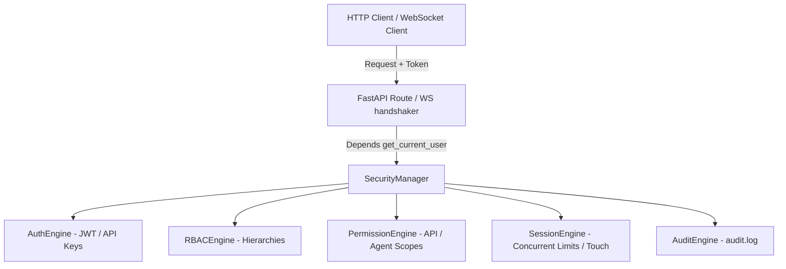
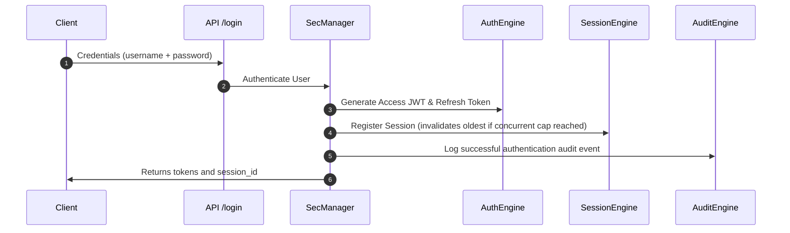

# Enterprise Security, Identity & RBAC Platform

Kisan Mitra AI utilizes an enterprise-grade security architecture designed to authenticate clients, enforce role-based access control, enforce permission checks on resources and specialist agents, manage session lifetimes, and track security operations in an immutable audit pipeline.

---

## 1. Security Architecture Overview

The security layer resides in `backend/app/security/` and coordinates with the API routing controllers, WebSocket gateways, and the AI agent execution pipelines.

---

## 2. Authentication Flow

The authentication engine supports three token formats resolved by `auth_engine.py`:
- **JSON Web Tokens (JWT)**: HMAC-SHA256 signature containing claims like sub and role. Access tokens expire in 15 minutes.
- **Refresh Tokens**: Cryptographically signed tokens used to refresh access tokens, expiring in 7 days.
- **API Keys**: Keys starting with `km_api_` mapping directly to user IDs.
- **Service Tokens**: Tokens starting with `km_svc_` for machine-to-machine integrations.

---

## 3. RBAC Hierarchy Model

Access rights are structured hierarchically under `rbac_engine.py` to allow inheritance checks:
- **`Super Admin`** inherits Admin, Operator, Support, Farmer, and Developer permissions.
- **`Admin`** inherits Operator, Support, and Farmer permissions.
- **`Operator`** inherits Support and Farmer permissions.
- **`Support`** inherits Farmer permissions.
- **`Developer`** inherits Support permissions.
- **`Farmer`** has base permissions.

---

## 4. Resource Permission Matrix

Granular capabilities are enforced at the resource layer via `permission_engine.py`. Roles are mapped to allowed scopes:

| Role | Allowed Scopes & Wildcards | Specialist Agents Access | Knowledge Providers |
| :--- | :--- | :--- | :--- |
| **Super Admin** | `*` (All capabilities) | All agents | All libraries |
| **Admin** | `page:dashboard`, `page:admin`, `api:admin`, `api:observability`, `admin:write` | All agents (`agent:*`) | All libraries (`knowledge:*`) |
| **Operator** | `page:dashboard`, `api:query`, `api:observability`, `api:telemetry` | `Weather`, `Market`, `Knowledge`, `GovernmentScheme` | `weather`, `market`, `schemes`, `crops` |
| **Support** | `page:farmer`, `api:query` | `Weather`, `Market` | `weather`, `market` |
| **Farmer** | `page:farmer`, `api:query` | `Weather`, `Market`, `GovernmentScheme` | `weather`, `market`, `schemes` |
| **Developer** | `page:analytics`, `api:observability`, `api:telemetry` | `Verifier`, `Planner` | All libraries (`knowledge:*`) |

---

## 5. Session Management

Sessions are managed in memory by `session_engine.py`:
- **Concurrent Session Cap**: Limits active sessions to a maximum threshold (default `3` per user). If a 4th session is created, the oldest active session is automatically invalidated.
- **Inactivity Timeout**: Detects idle sessions after `1800` seconds (30 minutes) of inactivity during request touches.

---

## 6. Audit Logging Pipeline

All security operations publish to the audit logger (`logs/audit.log`) via `audit_engine.py`. The engine maintains a rolling list of the latest 100 events in memory, exposed via endpoints:

- **Authentication Events**: Login, logout, token refresh, and invalid credential attempts.
- **Authorization Failures**: Forbidden role checks and blocked actions.
- **Role/Permission Changes**: Modification of credentials or access matrices.
- **Sensitive Route Access**: Requests to administrative endpoints `/api/v1/admin/*`.
