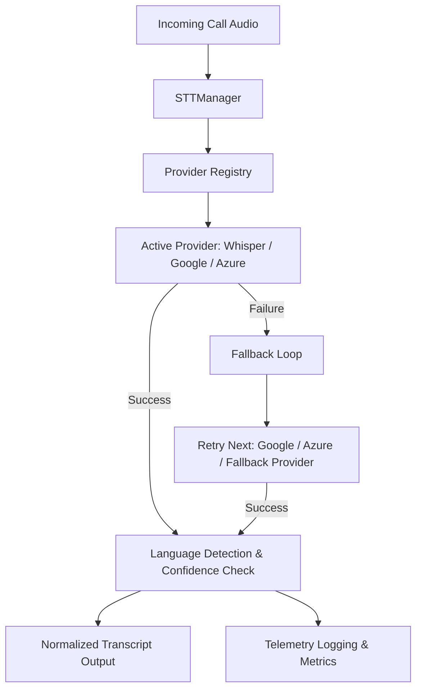

# Speech-to-Text (STT) Platform

This document outlines the architecture, pipeline, selection strategies, and telemetry integrations of the production-ready **Speech-to-Text Platform** in Kisan Mitra AI.

---

## 1. System Architecture

The STT Platform is designed to support modular adapters for multiple speech service backends with thread-safe registry operations, dynamic fallback sequencing, and strict type safety.



---

## 2. Speech-to-Text Pipeline

When the voice pipeline processes incoming speech from basic mobile devices, the audio bytes transition through five key processing layers:

1.  **Provider Registry**: Resolves the target or active provider (e.g. Whisper, Google, Azure, or Fallback).
2.  **Speech-to-Text Conversion**: Submits audio bytes via asynchronous HTTP requests to the target speech adapter.
3.  **Language Detection**: Dynamic auto-detection of regional languages if `language="auto"` is selected, fallback-routing to standard Indian settings.
4.  **Confidence Assessment**: Validates output transcript strings and assesses confidence thresholds.
5.  **Normalized Transcript**: Standardizes text formats for parsing and AI routing.

---

## 3. Provider Selection & Fallback Flow

### Runtime Selector
The system allows specifying custom providers at run-time:
```python
# Select explicit provider
stt_result = await stt_manager.transcribe(audio_bytes, provider="google")
```
If no provider name is specified, the manager uses the active default provider resolved from the `ProviderRegistry`.

### Fallback Policy
To ensure high availability in poor network conditions, the engine executes a failover sequence:
1.  **Primary Attempt**: Submit transcription request to the selected provider.
2.  **Network or Parse Failure**: Catch warnings and automatically switch to the next fallback option in the order: `["whisper", "google", "azure", "fallback"]`.
3.  **Automatic Retry**: Resubmit audio bytes to the fallback provider.
4.  **Safeguard Catch**: If all primary API requests fail, the registry delegates to `FallbackProvider`, which decodes input mock data or issues a standard status placeholder.
5.  **Audit Switch Logging**: Every fallback switch is tracked via logging and telemetric increments.

---

## 4. Language Pipeline & Regional Customizations

The platform supports:
-   **English (`en`)**
-   **Hindi (`hi`)**
-   **Kannada (`kn`)**
-   **Telugu (`te`)**
-   **Tamil (`ta`)**
-   **Punjabi (`pa`)**

If the input request enables language auto-detection (`language="auto"`), the manager uses heuristic language identification to parse and extract the target regional dialect from metadata, defaulting to Hindi (`hi`) for general agricultural queries.

---

## 5. Observability & Latency Metrics

The STT Platform records high-resolution telemetry diagnostics to track operations, billing latency, and speech accuracy:

| Metric Name | Type | Description |
| :--- | :--- | :--- |
| `stt_latency_ms` | Telemetry Record | Measures the end-to-end network request and transcription parsing time. |
| `stt_confidence` | Telemetry Record | Captures the output confidence rating (0.0 to 1.0) of the successful provider. |
| `stt_retries` | Telemetry Record | Count of failover retries triggered during a single session transaction. |
| `stt_failures` | Telemetry Record | Accumulation count of provider error events. |
