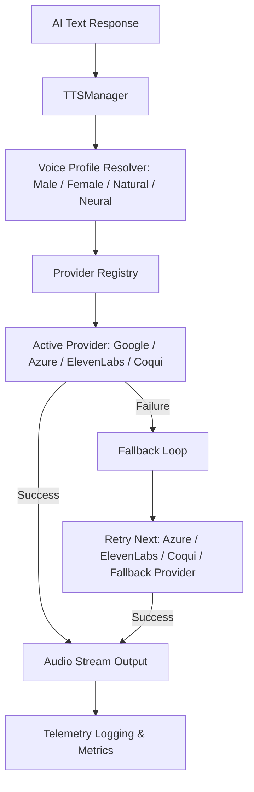
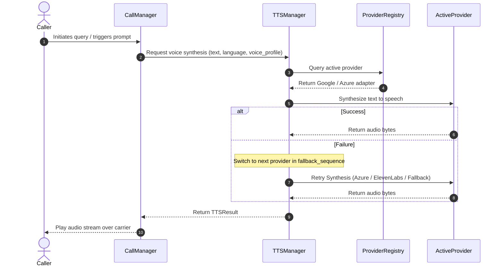

# Text-to-Speech (TTS) Platform

This document outlines the architecture, pipeline, selection strategies, voice configurations, and telemetry integrations of the production-ready **Text-to-Speech Platform** in Kisan Mitra AI.

---

## 1. System Architecture

The TTS Platform is designed to support modular adapters for multiple speech synthesis engines with thread-safe registry operations, dynamic fallback sequencing, and strict type safety.



---

## 2. Audio Pipeline

The text payload synthesized for the farmer is processed through five pipeline phases:

1.  **Language Detection / Map**: Decodes the session language preference (e.g. Hindi, English, Kannada, Telugu, Tamil, Punjabi).
2.  **Voice Profile Selection**: Evaluates voice requests (Male, Female, Natural, Neural) and maps them to neural voices tailored to the dialect.
3.  **Provider Registry**: Dynamic runtime provider selection.
4.  **Speech Synthesis**: Converts the parsed text string into PCM/MP3 audio waves.
5.  **Audio Stream & Observability**: Dispatches synthesized audio streams and records latencies.

---

## 3. Provider Selection & Fallback Flow

### Fallback Policy
To safeguard system availability, the engine handles failover recovery:
1.  **Initial Attempt**: Submits text to the selected active provider.
2.  **Connection / API Timeout**: Switches dynamically to fallback options in the order: `["google", "azure", "elevenlabs", "coqui", "fallback"]`.
3.  **Automatic Retry**: Submits text to the fallback provider.
4.  **Safeguard Catch**: If all APIs fail, the registry delegates to `FallbackProvider`, which encodes input text directly as bytes.
5.  **Audit Switch Logging**: Every fallback switch is tracked via logging and telemetric increments.

---

## 4. Voice Profiles & Accent Configs

We support standard voice profiles per language:
-   **English (`en`)**: Male, Female (Jenny Neural), Natural, Neural.
-   **Hindi (`hi`)**: Male, Female (Swara Neural), Natural, Neural.
-   **Kannada (`kn`)**, **Telugu (`te`)**, **Tamil (`ta`)**: Custom regional accents.

Voice selections map dynamically:
```python
# Synthesis utilizing voice profiles
tts_result = await tts_manager.synthesize(text="weather forecast", language="hi", voice_profile="female")
```

---

## 5. Sequence Diagram



---

## 6. Observability & Telemetry Metrics

| Metric Name | Type | Description |
| :--- | :--- | :--- |
| `tts_latency_ms` | Telemetry Record | Measures synthesis time of the successful provider. |
| `tts_duration_ms` | Telemetry Record | Captures the duration of synthesized audio. |
| `tts_retries` | Telemetry Record | Count of failover retries triggered during synthesis. |
| `tts_failures` | Telemetry Record | Accumulation count of provider error events. |
