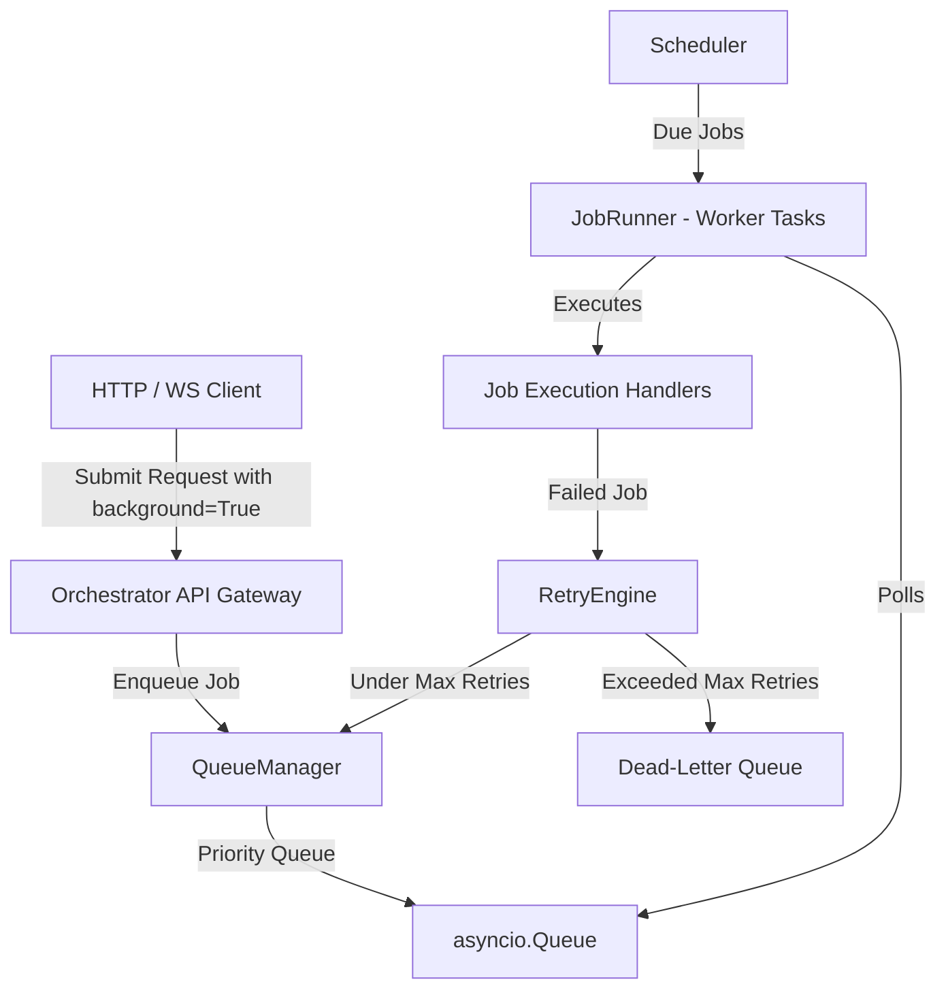
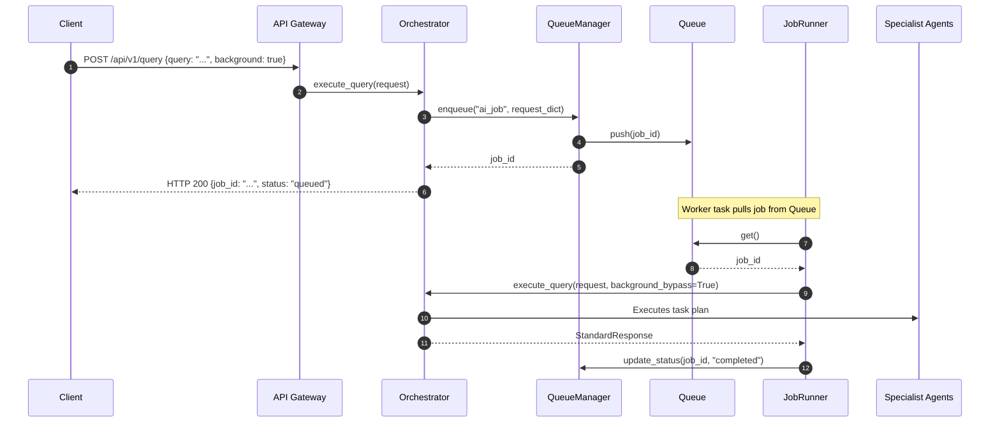

# Workflow Automation & Background Processing Platform

The Kisan Mitra AI Workflow Automation & Background Processing Platform enables non-blocking, reliable, and scalable execution of background operations such as AI queries, automated reminder checks, knowledge source refreshes, and maintenance routines.

---

## 1. Architecture Overview

The background processing system integrates into the main FastAPI container lifecycle and coordinates asynchronous execution pipelines using worker task pools:

---

## 2. Execution Model (Workflow Engine)

The `WorkflowEngine` implements execution parsing of three generic workflow step definitions:
- **Sequential Steps (`Task`)**: Executes steps in chronological order. The output or state changes are passed along via a shared context dictionary.
- **Parallel Steps (`ParallelStep`)**: Executes multiple tasks concurrently using `asyncio.gather`, yielding control back only when all tasks in the step finish.
- **Conditional Branches (`ConditionalStep`)**: Evaluates a callable check function at runtime to select between two branching execution paths.
- **Timeouts & Safety**: Enforces maximum timeout limits on tasks via `asyncio.wait_for`, preventing rogue threads or deadlocks.

---

## 3. Queue Design

Background tasks are enqueued asynchronously in the thread-safe `QueueManager`:
- **Prioritization**: Supports `High`, `Medium`, and `Low` priorities.
- **Status Tracing**: Exposes real-time job status querying (`pending`, `running`, `completed`, `failed`, `retrying`).
- **Telemetry Integration**: Regularly publishes queue depth and execution metrics to the `ObservabilityManager`.

### Supported Background Jobs
1. `ai_job`: Non-blocking, long-running AI plan routing.
2. `notification`: Delayed SMS or push alert dispatches.
3. `knowledge_refresh`: Periodic vector database rebuilds.
4. `memory_summarization`: Offline context compression.
5. `digital_twin_update`: Periodic simulator runs.
6. `report_generation`: Offline report generation.

---

## 4. Scheduler Architecture

The `Scheduler` coordinates time-delayed, recurring, and event-triggered executions:
- **Cron Jobs**: Parses standard 5-field cron layout (e.g. `*/5 * * * *`) via minute-based lookup.
- **Interval Jobs**: Runs tasks periodically every N seconds.
- **One-time Jobs**: Runs a task once after N seconds.
- **Event-triggered Jobs**: Automatically registers callbacks bound to platform events emitted via the `EventBus`.

---

## 5. Retry Strategy (Retry Engine)

Failures are handled systematically by `RetryEngine`:
- **Exponential Backoff**: Reschedules failing jobs with progressively longer delays:
  $$\text{Delay} = \text{Initial Delay} \times (\text{Backoff Factor})^{\text{Attempt} - 1}$$
- **Dead-Letter Queue (DLQ)**: Isolates persistently failing jobs exceeding maximum attempts for diagnostic debugging.
- **Observability**: Increments `failed_jobs` count and tracks failure metrics on the metrics engine.

---

## 6. End-to-End Sequence Diagram

The following diagram illustrates a client submitting a long-running AI query execution request:

