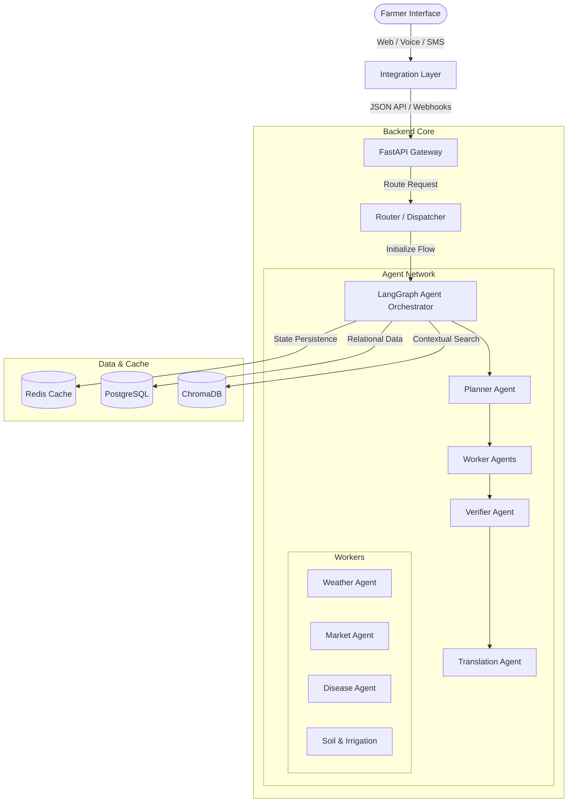

# Kisan Mitra AI - Architecture Specification

This document provides a high-level architectural overview of the **Kisan Mitra AI** platform. It defines the design patterns, system boundaries, data flows, and structural layers required for the enterprise-grade multi-agent agronomic platform.

---

## 1. System Overview

Kisan Mitra AI is designed to deliver expert-level agricultural advisory services to farmers. The platform is designed around three main principles:
1. **Accessibility**: Supporting Web UI, Interactive Voice Response (IVR), Speech-to-Text/Text-to-Speech (STT/TTS), and SMS notifications.
2. **Contextual Accuracy**: Integrating local weather conditions, commodity prices, disease parameters, and regional soil characteristics.
3. **Multi-Agent Coordination**: Activating specialized LLM agents to research, analyze, translate, and verify advisories.

---

## 2. Technical Stack

*   **Frontend**: Next.js 14+ (App Router), React, TypeScript, Tailwind CSS, shadcn/ui.
*   **Backend**: FastAPI (Python 3.12+), asynchronous routing, lifespan lifecycle management, structured logs.
*   **Agent Orchestration**: LangGraph (state management & execution graphs), LangChain (core abstractions).
*   **Databases**:
    *   **PostgreSQL**: Relational storage for farmer profiles, credentials, history, configurations.
    *   **ChromaDB**: High-performance vector database for RAG (Retrieval-Augmented Generation) on agricultural manuals, crop databases, and guidelines.
    *   **Redis**: Key-value cache and session management to store weather and market price API responses.
*   **Infrastructure**: Docker, Docker Compose, Nginx (local reverse proxy).

---

## 3. Clean Architecture Design (Backend)

The backend follows Clean Architecture principles, ensuring separation of concerns and independent testability:

1.  **Domain Entities (`app/models/`)**: Standard business models (e.g., Farmer profile, crop record). Free of framework code.
2.  **Use Cases (`app/services/`)**: Business services coordinating tasks (e.g., calculating weather impact, fetching market forecasts).
3.  **Interface Adapters (`app/api/`)**: Controllers translating API requests (FastAPI endpoints) into service calls and returning serialization schemas.
4.  **External Frameworks (`app/database/`, `app/orchestrator/`)**: Database connection pools, Docker bindings, and LangGraph integration setup.

---

## 4. Multi-Agent Coordination Flow

1.  **Ingress**: The request arrives via API, SMS webhook, or IVR system.
2.  **Planning Phase**: The `Planner Agent` analyzes intent, fetches user context, and builds a dependency list.
3.  **Parallel Execution**: The orchestrator triggers specialized worker nodes in parallel (e.g., fetching weather forecasts and checking commodity prices simultaneously).
4.  **Verification**: The `Verifier Agent` validates output against ground-truth static datasets stored in `knowledge/`.
5.  **Translation**: The `Translation Agent` translates the advisory to the farmer's regional dialect.
6.  **Egress**: The response is dispatched back to the caller via the respective channel (Audio file, text message, or JSON payload).
