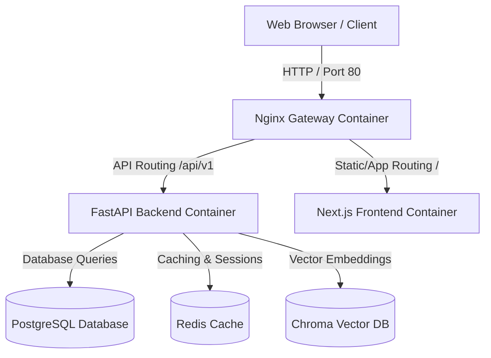

# Production Deployment Guide

This guide describes the procedures for launching the **Kisan Mitra AI** platform in a secure, production-grade environment.

---

## Architecture Overview

The production environment is built upon a multi-container stack orchestrated via Docker Compose and fronted by an Nginx reverse proxy.



---

## Infrastructure Requirements

*   **Operating System**: Linux (CentOS 8+, Ubuntu 22.04 LTS recommended)
*   **Container Platform**: Docker Engine 24.0.0+ & Docker Compose v2.20.0+
*   **Hardware Sizing (Minimum)**: 2 vCPUs, 4GB RAM, 20GB SSD Storage
*   **Hardware Sizing (Recommended)**: 4 vCPUs, 8GB RAM, 50GB NVMe SSD Storage

---

## Deployment Steps

### 1. Clone & Set Up Directory Structure

Clone the repository and verify that folder paths are initialized:
```bash
git clone https://github.com/organization/kisan-mitra-ai.git
cd kisan-mitra-ai
```

### 2. Configure Environment Secrets

Copy the production configuration template and edit the secrets:
```bash
cp deployment/config/.env.production .env
nano .env
```

Ensure the following variables are configured with strong, secure secrets:
*   `DB_PASSWORD` (Change from `postgres`!)
*   `DB_USER`
*   `GEMINI_API_KEY`
*   `OPENAI_API_KEY`

### 3. Build & Launch Containers

Run the compose command to compile images and start all services in detached mode:
```bash
docker compose up -d --build
```

### 4. Verify Status

Check container states to confirm they are running and healthy:
```bash
docker compose ps
```

Verify application readiness using Nginx gateway route:
```bash
curl -f http://localhost/api/v1/health/readiness
```

---

## Security & Network Isolation

*   **Non-Root Context**: Processes in the Backend (`appuser`) and Frontend (`node`) containers execute as non-privileged users.
*   **Network Bridging**: All components reside inside the custom `kisan_network` bridge. External access is only allowed through the Nginx container on port 80/443.
*   **Volume Persistence**: Postgres database data, Redis caching state, Chroma records, and backend logs are saved in persistent volumes.
