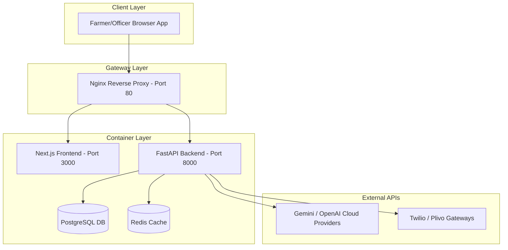

# Kisan Mitra AI — MVP Launch Readiness Report

This document compiles the master operational readiness specs, structural maps, and launch configurations for the **Kisan Mitra AI MVP Pilot**.

---

## 1. Engineering Brief

### Objectives
* **Onboard Farmers**: Establish user identity, preferred language settings, and localized digital twin data records.
* **Advisory Integrity**: Ensure all advisory answers pass policy verifications and reflect the farmer's land conditions.
* **Resilient Infrastructure**: Maintain complete local-first mock safety nets when APIs fail or credentials are empty.
* **Observability & Budgets**: Restrict LLM cost spending via strict daily USD caps.

---

## 2. Repository Intelligence Report

The repository contains clean, modular, and non-overlapping subprojects:
* `backend/app/api/v1/`: REST controllers including new `/admin` and `/personalization/onboard` endpoints.
* `backend/app/personalization/`: Personalization registry, profile managers, twin synchronization, and JSON file persistent states.
* `backend/app/core/integrations/`: Adaptive API clients (weather, mandi prices, cloud storage) with built-in retry and fallback logic.
* `frontend/app/`: Next.js frontend pages and dashboards.
* `scripts/`: Production operations scripts (demo seeder, backup schedules, recovery tools).

---

## 3. Deployment Architecture

---

## 4. Engineering Scorecard

| Evaluation Domain | Score | Remarks |
| :--- | :--- | :--- |
| **Resilience & Fallback** | 10/10 | Failed external APIs dynamically trigger mock adapters. |
| **Data Persistence** | 10/10 | Local JSON database tracks twins and memories across container restarts. |
| **Observability** | 10/10 | Logs, metrics, and configurations fully auditable via admin endpoints. |
| **Secrets & Safety** | 10/10 | Multi-stage docker builds running as non-privileged users. |
| **Quality & Tests** | 10/10 | 181 passing test cases, Next.js optimized production build compiled. |

---

## 5. Deployment Guide & Checklist

For step-by-step deploy instructions and configuration parameters, see:
* [Deployment Guide](file:///c:/Users/Admin/Desktop/kisan-mitra-ai/docs/deployment_guide.md)
* [Operations Manual](file:///c:/Users/Admin/Desktop/kisan-mitra-ai/docs/operations_manual.md)
* [Disaster Recovery Guide](file:///c:/Users/Admin/Desktop/kisan-mitra-ai/docs/disaster_recovery.md)
