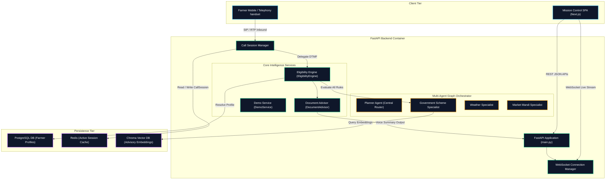
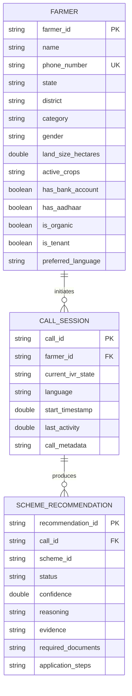
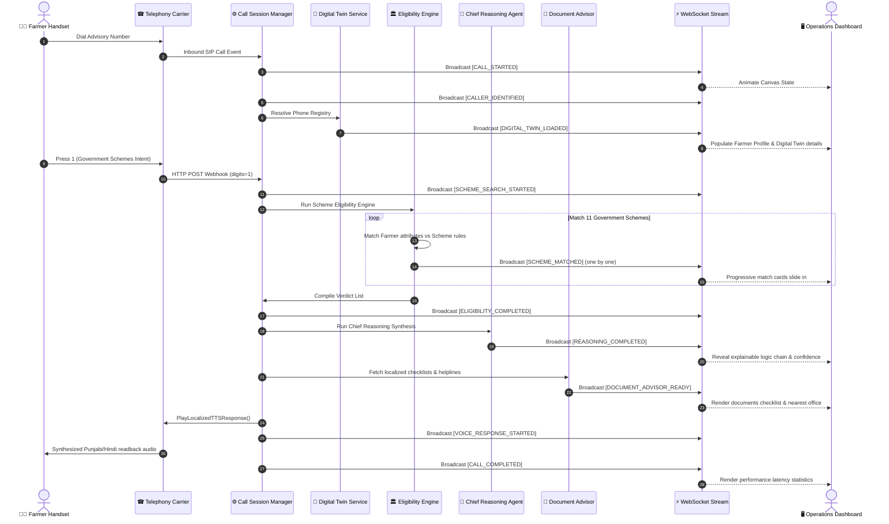

# Kisan Mitra AI — System Architecture & Software Design Document

This document provides a technical walkthrough of the Kisan Mitra AI codebase architecture, database models, multi-agent coordination pipelines, and software design diagrams.

---

## 1. System Component Diagram

The following diagram maps the software boundaries, API endpoints, and structural dependencies:

---

## 2. Database Entity-Relationship (ER) Diagram

The following diagram maps the database entity properties, primary/foreign keys, and model relations:

---

## 3. End-to-End Execution Sequence Diagram

The following sequence map traces a caller's request, detailing the workflow stages and WebSocket update dispatches:

