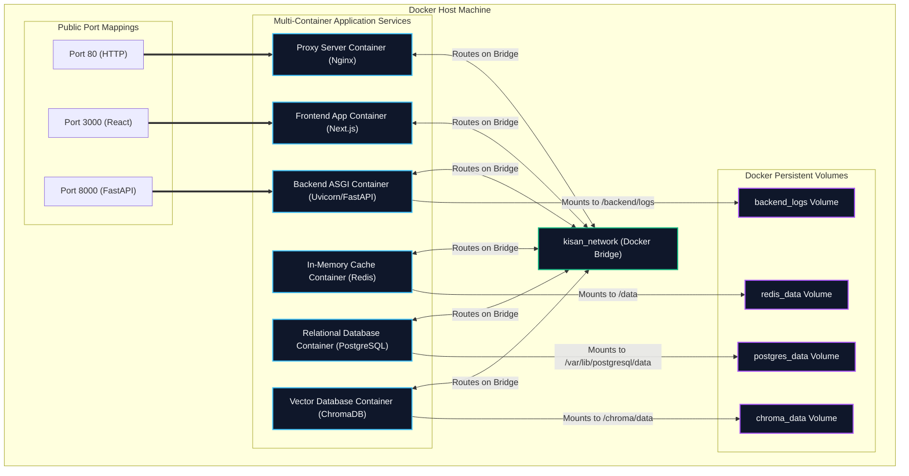

# Kisan Mitra AI — Deployment Architecture & Administrator Guide

This document outlines the container deployment model, configuration variables, system startup guides, and server health check instructions for system administrators.

---

## 1. Container Deployment Diagram

The following diagram maps the network partitions, container boundaries, port mappings, and persistent volume definitions:



---

## 2. Administrator Guide

### 2.1 Server Requirements & Sizing

| Metric | Minimum Specification | Recommended Specification |
|--------|-----------------------|---------------------------|
| **VCPU** | 2 Cores | 4 Cores |
| **System Memory** | 4 GB | 8 GB |
| **Storage Space** | 20 GB (SSD) | 50 GB (SSD) |
| **OS Environment** | Ubuntu 22.04 LTS | Rocky Linux 9 / Debian 12 |

---

### 2.2 Pre-Flight Installation Checklist

1. **Docker Engine**: Install Docker version 24.0 or higher.
2. **Docker Compose**: Ensure `docker-compose-plugin` (version 2.20+) is available.
3. **Environment Setup**: Copy `.env.example` to `.env` and fill in:
   - `GEMINI_API_KEY` (Required for LLM specialized agents fallback).
   - `DB_PASSWORD` (Replace default passwords).
4. **Hosts Config**: Verify local DNS / Nginx proxy redirects requests to Port 80.

---

### 2.3 One-Click Startup Procedures

#### On Windows (Development / Local Demo)
We have packaged a simple PowerShell launcher at the repository root:

```powershell
.\start.ps1
```

This starts:
- Uvicorn backend server on `http://localhost:8000` in a dedicated command shell.
- Next.js development server on `http://localhost:3000` in a second command shell.

#### On Linux (Production Containerized)
Execute standard Docker compose boot sequence:

```bash
# Build and run containers in detached mode
docker-compose up --build -d

# Verify container statuses and healthchecks
docker-compose ps
```

---

### 2.4 Maintenance & Diagnostic Logs

To inspect logs from the container stack:

```bash
# View backend application logs
docker-compose logs -f backend

# View reverse proxy Nginx routing logs
docker-compose logs -f proxy

# In case of DB errors, check postgres startup logs
docker-compose logs -f db
```
